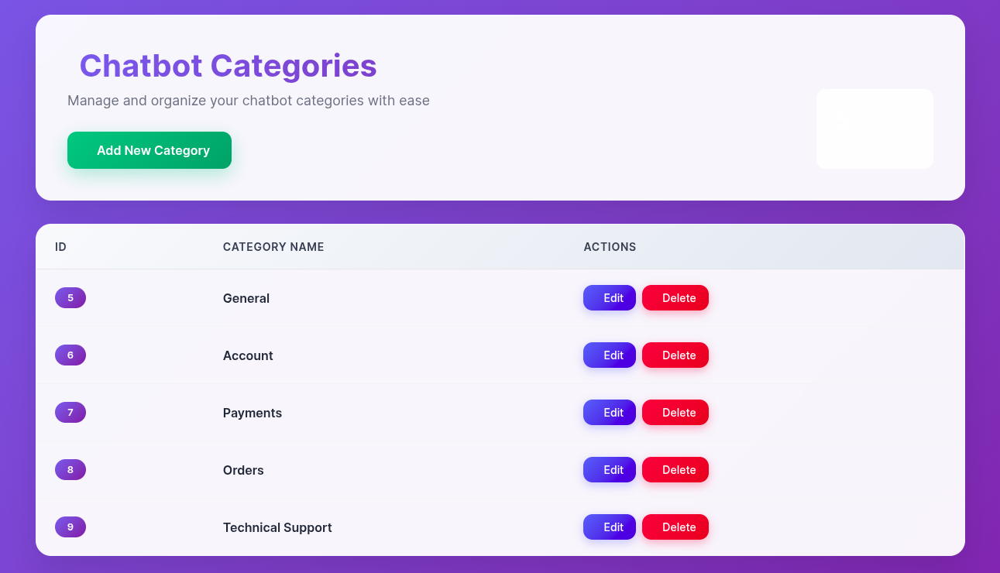
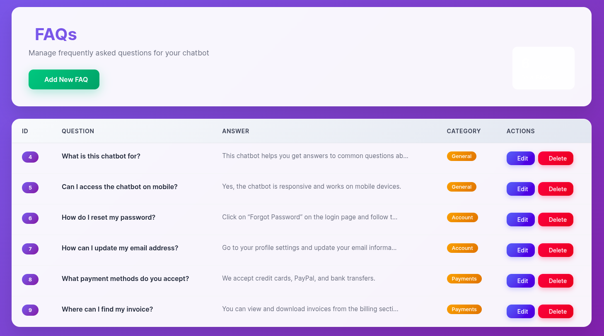
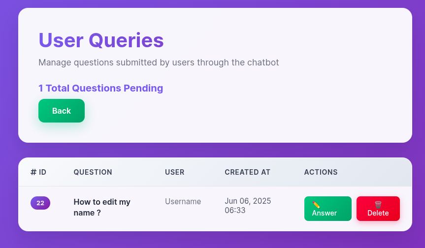
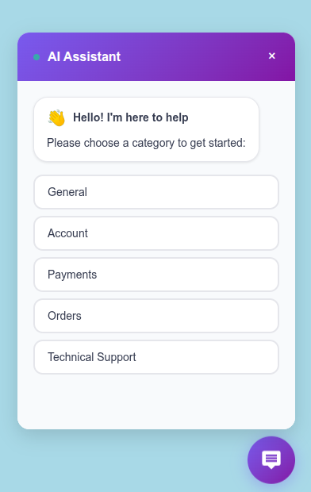
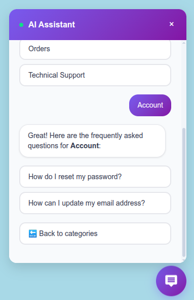
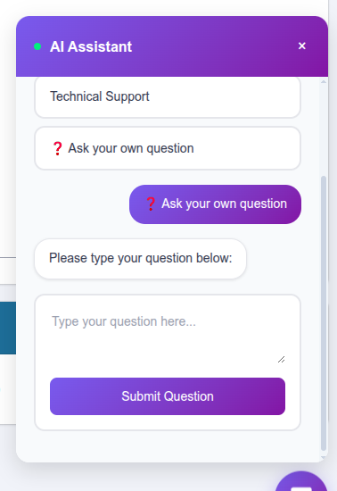

---

# Chatbot Bundle

A Symfony bundle that provides a menu-based chatbot widget with category management and FAQ functionality. The chatbot appears as a floating button on the right side of your website and allows users to browse categories and get answers to frequently asked questions.

---

## Features

* 🤖 Interactive chatbot widget
* 📁 Category management system
* ❓ FAQ management with category-wise organization
* 🎨 Floating button interface design
* 🔧 Easy integration with existing Symfony projects

---

## Installation

### Step 1: Install the Bundle

Install the chatbot bundle using Composer:

```bash
composer require patel/chatbot-bundle
```

### Step 2: Register the Bundle

Add the bundle to your `config/bundles.php` file:

```php
return [
    // ... other bundles
    Chatbot\ChatbotBundle::class => ['all' => true],
];
```

### Step 3: Install Assets

```bash
php bin/console assets:install --symlink
```

This will publish necessary asset files to the `public/bundles/` directory.

### Step 4: Create and Run Migrations

Generate and execute the database migrations:

```bash
php bin/console make:migration
php bin/console doctrine:migrations:migrate
```

### Step 5: Include the Chatbot Widget

Include the widget in your base template (`templates/base.html.twig`):

```twig
<body>
    {{ include('@Chatbot/chatbot_widget.html.twig') }}
    <!-- Your content -->
</body>
```

### Step 6: Add Routes

Add the following to `config/routes.yaml`:

```yaml
chatbot_bundle:
  resource: '@ChatbotBundle/Resources/config/routes.yaml'
```

### Step 7: Add in your services.yaml

```yaml
Chatbot\Repository\UserQuestionRepositoryInterface: '@App\Repository\UserQuestionRepository'
```

### Step 8: Add Configuration

Create the file `config/packages/chatbot.yaml`:
Create the file config/packages/chatbot.yaml and set the user_question_entity parameter to the fully qualified namespace of your user question entity class.

```yaml
chatbot:
    role: ROLE_CHATBOT_ADMIN
    user_question_entity: App\Entity\UserQuestion
```

---

### Step 9: User-Submitted Questions

Users can submit their own questions through the chatbot. Admins can respond and choose to publish them in the FAQ. Users receive email notifications when their question is answered.

### Implement `ChatbotUserInterface`

In your user entity (e.g., `Admin`):

```php
use Chatbot\Security\ChatbotUserInterface;
use Doctrine\Common\Collections\ArrayCollection;

class Admin implements ChatbotUserInterface
{
    #[ORM\OneToMany(mappedBy: 'user', targetEntity: UserQuestion::class)]
    private Collection $questions;

    public function __construct()
    {
        $this->questions = new ArrayCollection();
    }

    public function getQuestions(): Collection
    {
        return $this->questions;
    }
}
```

###  Create a `UserQuestion` Entity

```php
namespace App\Entity;

use Chatbot\Entity\ChatbotUserQuestion as BaseQuestion;
use Chatbot\Security\ChatbotUserInterface;
use Doctrine\ORM\Mapping as ORM;

#[ORM\Entity]
#[ORM\Table(name: 'chatbot_user_question')]
class UserQuestion extends BaseQuestion
{
    #[ORM\ManyToOne(targetEntity: Admin::class, inversedBy: 'questions')]
    #[ORM\JoinColumn(nullable: false)]
    private ChatbotUserInterface $user;

    public function getUser(): ChatbotUserInterface
    {
        return $this->user;
    }

    public function setUser(ChatbotUserInterface $user): static
    {
        $this->user = $user;
        return $this;
    }
}
```

###  Configure Email Notifications

Set the `FROM_EMAIL` in your `.env`:

```dotenv
FROM_EMAIL="your@email.com"
```

---

## Usage

### Category Management

Visit `/chatbot/category` to:

* Add new categories
* Edit or delete existing ones

### FAQ Management

Visit `/chatbot/faq` to:

* Add new FAQs with answers
* Edit or remove outdated questions
* Assign FAQs to categories

### User Interaction

* Users click the chatbot button on the website
* Categories are shown
* Clicking a category reveals related FAQs
* Users can ask their own questions

---

## Customizing Templates

### Step 1: Locate Original Templates

* `vendor/patel/chatbot-bundle/src/Resources/views/category/`
* `vendor/patel/chatbot-bundle/src/Resources/views/faq/`

### Step 2: Create Override Directories

```bash
mkdir -p templates/bundles/ChatbotBundle/category
mkdir -p templates/bundles/ChatbotBundle/faq
```

### Step 3: Copy Templates

```bash
cp vendor/patel/chatbot-bundle/src/Resources/views/category/index.html.twig templates/bundles/ChatbotBundle/category/
cp vendor/patel/chatbot-bundle/src/Resources/views/faq/index.html.twig templates/bundles/ChatbotBundle/faq/
```

### Step 4: Clear Cache

```bash
php bin/console cache:clear
```

---

## Available Routes

| Path                         | Name                           | Purpose                         |
| ---------------------------- | ------------------------------ | ------------------------------- |
| `/chatbot`                   | `chatbot`                      | Chatbot homepage                |
| `/chatbot/user-questions`    | `chatbot_user_questions_index` | Manage user-submitted questions |
| `/chatbot/category`          | `chatbot_category_index`       | Manage categories               |
| `/chatbot/faq`               | `chatbot_faq_index`            | Manage FAQs                     |
| `/chatbot/widget`            | `chatbot_widget`               | Display chatbot widget          |
| `/chatbot/faqs/{categoryid}` | `chatbot_faqs_by_category`     | Get FAQs by category (AJAX/API) |

---

## Flow Diagram

### 1. 📂 Category Management (Admin Panel)



### 2. ❓ FAQ Management (Admin Panel)



### 3. User Queries Management (Admin Panel)



### 4. 🤖 Chatbot Interface






---

## Customization

### Styling

Override default styles using your own CSS targeting the chatbot’s class names.

### Templates

As explained above, copy templates from the bundle and place them in:

* `templates/bundles/ChatbotBundle/category/`
* `templates/bundles/ChatbotBundle/faq/`

---

## Requirements

* PHP 8.2 or higher
* Symfony 6 or higher
* Doctrine ORM
* Twig

---

## Troubleshooting

### Assets Not Loading

* Run `php bin/console assets:install --symlink`
* Check `public/bundles/chatbot/` exists
* Ensure proper file permissions

### Database Errors

* Verify DB configuration
* Run: `php bin/console doctrine:schema:validate`
* Run: `php bin/console cache:clear`

### Twig Template Errors

* Check `twig.yaml` is correctly set up
* Verify `config/bundles.php` includes the bundle
* Clear the Twig cache

---

## Contributing

We welcome contributions! Feel free to open issues or submit pull requests for new features or bug fixes.

---

## License

This bundle is open-source and licensed under the MIT License.

---

## Support

If you need help or have questions, feel free to open an issue on GitHub or contact the development team.

---

**Happy chatting! 🤖**
